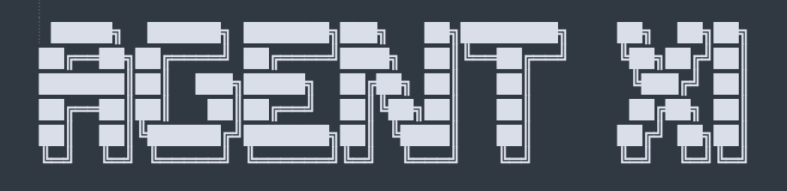

# Agent XI



An autonomous agent that plays season-long fantasy IPL cricket contests [on the official site](https://fantasy.iplt20.com/).

The project is an fun experiment for building decision-making agents in constrained environments rewarding long term planning. We use fantasy cricket because it has all the hard parts: limited budget, team rules, uncertainty, and delayed rewards.

Built on top of [Hermes Agent](https://github.com/NousResearch/hermes-agent/) [a better openclaw alt], which provides foundational infra for memory management, reasoning loops, and tool orchestration primitives. 

> **Follow this twitter thread to see how it fares:**  
> [https://x.com/krspy291/status/2035071178151493758?s=20](https://x.com/krspy291/status/2035071178151493758?s=20)


## Core Idea

The agent doesn't rely on pre-trained models or hardcoded/statistical heuristics (atleast not entirely). It learns by doing.

1. **Observe** — player stats, upcoming fixtures, availability signals built by polling IPL news,
2. **Think** — form beliefs about player value and form
3. **Decide** — decide on the window of fixtures, select the best playing 11 under game constraints; teams are picked not for a single match but for a window of matches like 2-4 so that it can reduce the no of transfers to be made + take advantage of matches where a single team plays twice
4. **Act** — output the team -- communicate to the user via telegram to review [will remove HITL in later phases]
5. **Reflect** — match happens, points come back, agent updates beliefs for form of players

---

## What's Built

### Pre-Season Initialization

Before the season starts, the agent seeds its knowledge base by pulling team previews from cricket sites. It extracts:

- Players ruled out or injured
- Predicted playing XIs for each franchise
- Initial availability and form signals

This gives the agent a starting point. From there, it updates its beliefs as the season progresses.

### Daily News & Status Tracking

The agent polls IPL news feeds daily. When it spots injury reports, team changes, or form signals, it flags them. Updates happen only after user confirmation — the agent proposes, you approve.

This keeps the agent's knowledge fresh without manual input. Player availability and form get updated as soon as credible signals appear.

### Team Selection (Integer Linear Programming)

Selecting the playing XI is framed as a constrained optimization problem—think of it like a sophisticated "knapsack" where you must fit role requirements, budget, and league-specific caps all at once. For any upcoming block of matches, the agent uses integer linear programming (ILP) to systematically search through possible combinations and identify the optimal 11 within these strict rules.

- **Budget:** 100 credits total
- **Roles:** 1–4 wicketkeepers, 3–6 batters, 1–4 all-rounders, 3–6 bowlers
- **Team limit:** Max 7 players from any one franchise
- **Overseas cap:** Max 4 international players
- **Optimizer for** an expected impact score that is built on players historical impact score [ESPNcricinfo's Impact Score](https://www.espncricinfo.com/series/indian-premier-league-2024-1410320/most-impactful-batters)
ILP guarantees every output is valid and optimal given the agent's current beliefs about player value. The math handles constraints; the agent handles judgment.

### Transfer Strategy [WIP]

The exciting part: deciding *when* to use your limited transfers.

Simulating past IPL seasons to discover optimal transfer timing. Inspired by Karpathy's auto-research approach, the agent runs multiple season replays testing different strategies (aggressive early, conservative wait-and-see, balanced selective), measures outcomes, and extracts principles about when transfers matter most.

Early findings suggest waiting through ~20% of matches before aggressive transfer planning — letting real form signals emerge before committing limited moves.

### Infrastructure

[Hermes Agent](https://github.com/NousResearch/hermes-agent/) [a better alternative to OpenClaw] provides a sleek agent infra for memory, reasoning loops, and task orchestration and a telegram communicate gateway out of the box. The domain layer (optimizers, data tools, reflection prompts) sits on top. CLI commands and Telegram skills make it easy to interact with the agent and execute decisions.

---

## Why we built it this way .?

Tbh, just wanted to get a hang of how good niche agents are built. Apart from that ..

**No model training.** Learning happens through experience, reflection, and memory. Match outcomes tell you what worked. Structured reasoning surfaces why decisions succeeded or failed. Knowledge accumulates and compounds over time. This is cognitive learning — closer to how humans improve at a sport than how neural nets are trained.

**Optimization is execution, not intelligence.** The ILP solver guarantees valid outputs under constraints. It's a tool, not the brain. The agent's job is to figure out *which* players are valuable. The optimizer just makes sure the math works out.

**Memory is the engine.** Player beliefs, match reflections, strategy notes — all persist. The agent doesn't start from scratch every match. It builds on what it learned yesterday, last week, last season. That's the advantage over static models or one-shot optimizers.

---

## Quick Start

### Setup

```bash
cd /AgentXI
python -m venv agent_venv
source agent_venv/bin/activate
pip install -r requirements.txt
```

### Generate a Team (Build 1)

```bash
# Pick best 11 for matches 1 and 2
python -m main.optimizer.run_match_ids 1 2

# With player locks/bans
python -m main.optimizer.run_match_ids 1 2 -p "Virat Kohli" -d "Bumrah"
```

### Manage Player Status (Build 2 / 3)

```bash
# Single update
python -m main.player_status update "Virat Kohli" -a available -f good

# Batch from JSON
python -m main.player_status batch updates.json

# View all non-default statuses
python -m main.player_status show
```

### Poll News (Build 2)

```bash
# Get new articles since last poll
python -m main.news poll

# Fetch article text
python -m main.news fetch "https://..."

# See recent feed (no state change)
python -m main.news latest -n 5
```

### Hermes Skills (if using Telegram)

Once Hermes is configured:

```
/agentxi-build-11        — Generate and format a team for Telegram
/agentxi-news            — Poll RSS, consent → update status
/agentxi-team-previews   — Seed status from pre-season hub URL
```

---

## File Layout

```
AgentXI/
├── main/
│   ├── optimizer/          # ILP team selection
│   ├── player_status.py    # Availability + form tracking
│   ├── news/               # RSS polling and article fetch
│   └── ...
├── data/
│   ├── squads.json         # Team rosters (static)
│   ├── player_status.json  # Status overlay (mutable)
│   ├── ipl_2026_schedule.csv
│   ├── new-combined-*.csv  # Metrics: batting, bowling
│   └── ...
├── rules/
│   ├── HOW_TO_PLAY.md      # Constraints and scoring
│   └── ...
├── markdowns/
│   ├── BUILD1_*.md         # Team selection docs
│   ├── BUILD2_*.md         # News + status docs
│   ├── BUILD3_*.md         # Pre-season seed docs
│   └── ...
└── .hermes_agent11/skills/ # Hermes skill definitions
```

---

## Data Sources


| File                       | What                                                    |
| -------------------------- | ------------------------------------------------------- |
| `squads.json`              | Official rosters (names, prices, overseas flag)         |
| `ipl_2026_schedule.csv`    | Matches, teams, dates                                   |
| `new-combined-batters.csv` | Weighted batting impact (per innings)                   |
| `new-combined-bowlers.csv` | Weighted bowling impact (per match)                     |
| `player_status.json`       | Mutable: availability + form (only non-defaults stored) |
| `rss_feed_state.json`      | Dedup: links already polled from news feed              |


---

## The Constraints

Season-long fantasy has strict rules that make this a real optimization problem (see [HOW_TO_PLAY.md](rules/HOW_TO_PLAY.md) for full details):

- **Budget:** 100 credits total (players cost 5–15 credits each)
- **Squad size:** Exactly 11 players
- **Role balance:** 1–4 wicketkeepers, 3–6 batters, 1–4 all-rounders, 3–6 bowlers
- **Franchise cap:** Max 7 players from any one team
- **Overseas limit:** Max 4 international players
- **Transfers:** Limited 160 transfers allowed. Every swap counts.

You can't just pick the best 11 players for a single match, but to plan for the long term. One bad early pick can lock you into a suboptimal squad for weeks, just picking the best 11 for each match would exhaust your credits in just 25% of the season.

This is why ILP (integer linear programming) is the right tool. It's built for resource allocation under constraints. The agent uses it to guarantee every team it proposes is valid and optimal given its current beliefs.

---

## Learning & Reflection

This project is an experiment in autonomous decision-making for long range tasks.  The goal is to watch how an agent thinks, adapts, and improves over time for a task that penalises myopic thinking. Also just couldn't resist the FOMO of agents  wanted to have some fun building some personal agents. 

This isn't about automating fantasy cricket. It's about building systems that can learn, reflect, and make better decisions in constrained, uncertain environments — the kind of problems that show up everywhere in the real world.

---

## Next Steps

1. **Seed the season:** `/agentxi-team-previews` (Cricbuzz hub URL) → initialize player_status.json
2. **Generate teams:** `/agentxi-build-11` (match IDs) → get suggested XI
3. **Monitor injuries:** `/agentxi-news` (hourly RSS) → update status on consent
4. **Reflect:** after matches, discuss what worked and what didn't
5. **Evolve:** agent memory compounds; strategies sharpen over time

---

## Questions?

See detailed docs:

- `markdowns/BUILD1_*.md` — team selection design and use
- `markdowns/BUILD2_*.md` — news polling and status
- `markdowns/BUILD3_*.md` — pre-season initialization
- `rules/GOAL.md` — full philosophy and architecture

