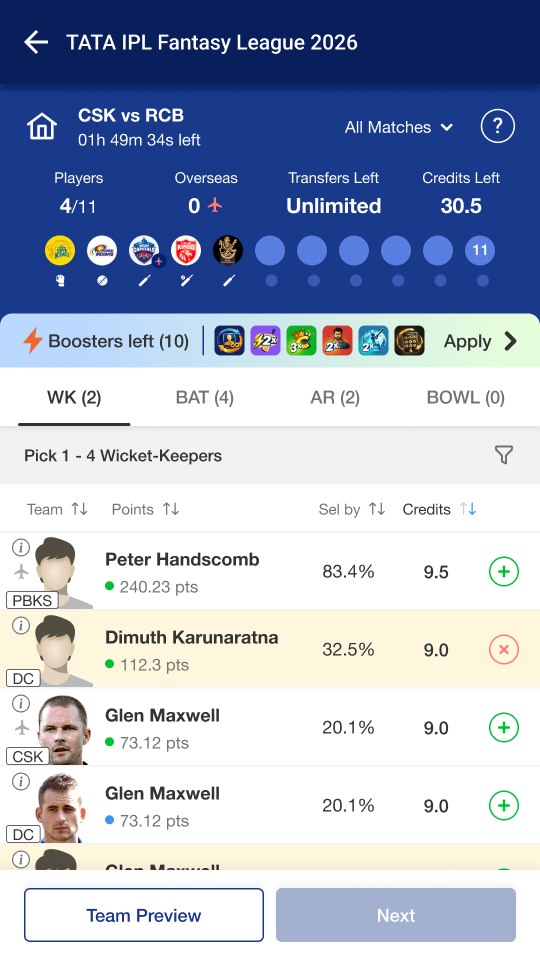
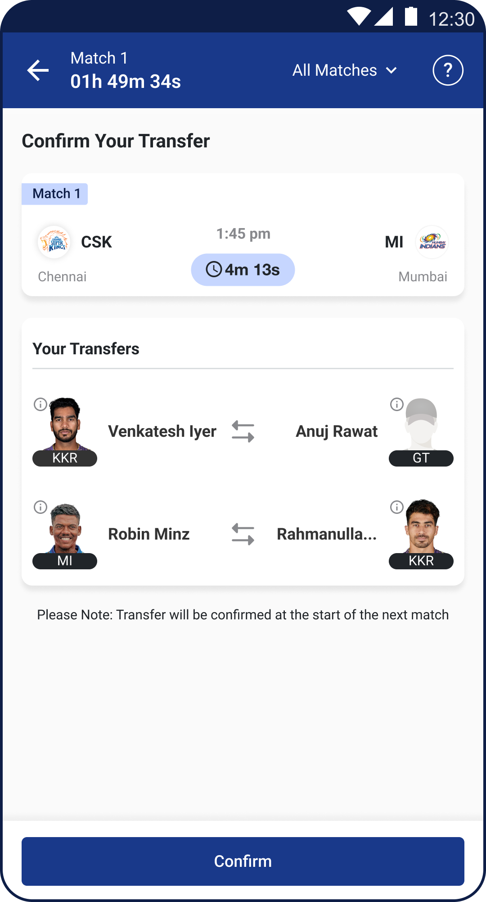
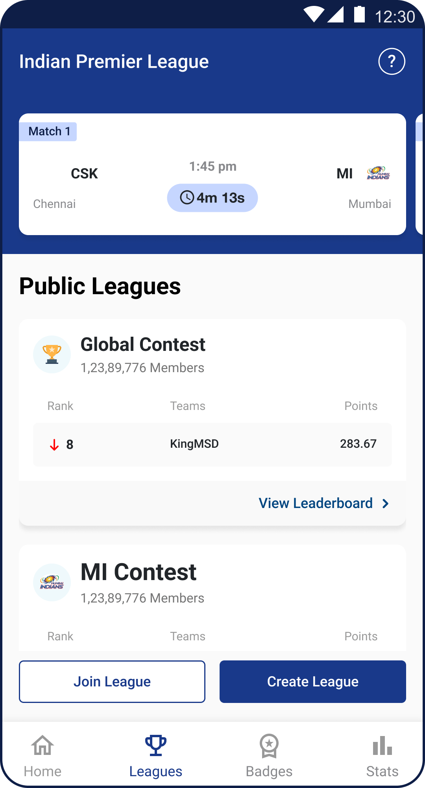
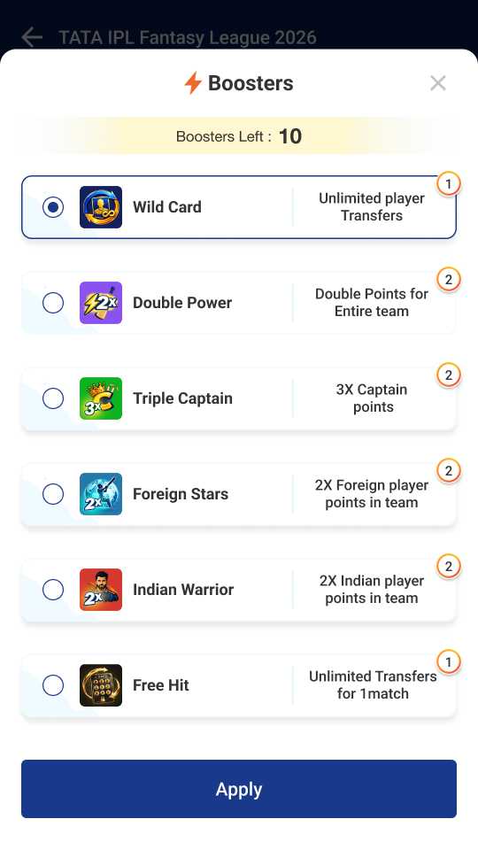

# HOW TO PLAY

## Team Creation

- Keep a check of the credits left, team value should not exceed 100 credits.
- You must pick:
  1. 1-4 Wicketkeepers 
  2. 3-6 Batters
  3. 1-4 All-rounders
  4. 3-6 Bowlers
- Keep checking for player’s availability to avoid selecting non-playing players:
  1. Green Dot – Player is part of the Playing XI
  2. Red Dot – Player is not part of Playing XI
  3. Blue Dot – Player is an Impact Substitute
  4. No dot means the player is not playing in the current match
- Use filters to narrow down the player list as per their Skills, Credits, and Teams.
- From your selected 11 players, you must pick:
  1. A Captain, who will give you 2x points of the points scored
  2. A Vice-captain, who will give you 1.5x points of the points scored
- You can pick a maximum of 7 players from a single team.
- You can pick a maximum of 4 overseas players.

## Transfers / Manage Team

- Before Match 1 starts, users can make as many changes to their teams.
- Users joining the IPL Fantasy League Game before Match 1 can make 160 transfers until Match 70 which is the end of the league stage.
- Users joining at any given point of time throughout the tournament will get 160 transfers until match 70.
- Between the end of League stage and 'Qualifier 1 users can again make unlimited transfers.
- Between 'Qualifier 1' and the 'Final', users can make up to 10 transfers.
- Users can freely change their "Captain" and "Vice-Captain" throughout the IPL Fantasy League.
- Transfers during any IPL match will only apply to the subsequent match.
- Only transfers made before a match starts will take effect for that match.
- Points to Remember :
  1. If a match is abandoned anytime, the system will behave as if the match has ended.
  2. Transfers and Booster deducted for the abandoned match will not be refunded.
  3. If a match gone live and fantasy points are accrued, points earned until the match has be abandoned will be retained.

## Leagues

- Users will automatically join the Overall League as soon as they have saved their teams for the first time.
- Private Leagues
  1. You can create and join up to a total of 20 private leagues
  2. Tap on share icon or ‘invite friends’ to invite anyone to Private Leagues you have created or joined.
  3. You can create/join multiple Private Contests and compete with your friends.
  4. The league creator or admin can remove a user or a new joinee before the joined users first match locks.
  5. If the league creator leaves the league, the first person to join will be automatically given admin privileges for the league.
  6. All users who join a private league start with 0 points in that contest and earn points for future matches.
  7. Once the private league is created successfully, you will be redirected to the invite page
  8. On this page, you can see the option to share the invite code through different mediums such as Whatsapp, SMS or any other sharable medium (using ‘more’ option)
  9. You can share this unique league code for your private league on any of the mediums
  10. You friends need to copy the league code and click on ‘Join a league’ to enter the copied league code
  11. Click on ‘Join a league’ by them will include them in the Private League you created

## Boosters

- Double Power: The entire team receives double points for a match.
- Indian Warrior: All Indian players playing in the current team earn double points for a match. .
- Triple Captain: The captain now earns triple points instead of the regular double for a match.
- Foreign Stars: All overseas players playing in the current team earn double points for a match.
- Free Hit: Enjoy unlimited transfers with no budget restrictions for a match. After the match, your team reverts to the previous line up.
- Wildcard: Allows unlimited transfers within a 100-credit budget for a match.
- Booster advantages except for Freehit and Wildcard will be disabled in Playoffs Leagues to ensure fair play and maintain a level playing field for all participants. These advantages will only be available in Global Leagues, Favourite Team Leagues, and Private Leagues.
